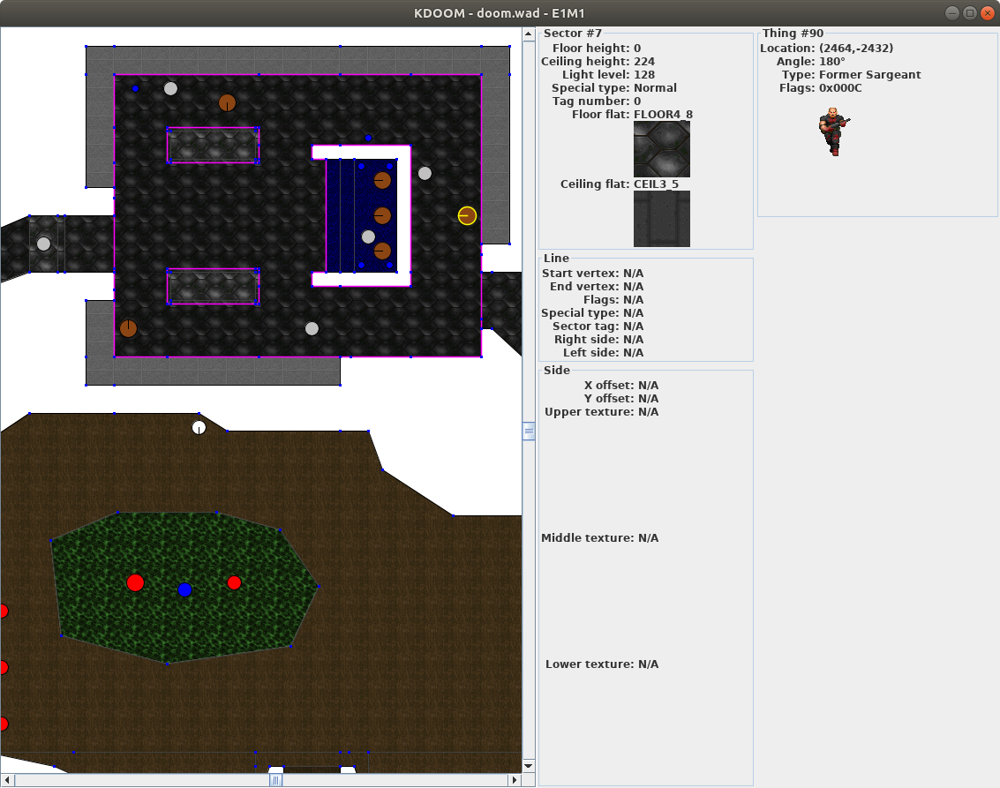

KDOOM
=====

A level viewer for the classic '90s FPS DOOM, which was my favorite game
growing up. I have fond memories strafing in circles around my dad, blasting
him with my shotgun while he threatened that if I didn't take it easier he
wasn't going to play any again next time.

He always played again next time.



When I was a teenager I spent untold hours creating custom levels. I probably
spent more time making levels than I did playing the game. I was in awe at the
level design programs people had created. I desperately wanted to make one
myself, but at 13 years old I didn't have the programming skills.

So at age 20 I wrote this as a way to show up my teenage self.

KDOOM in an exercise in decoding DOOM's [WAD] files, which store level, sprite,
and texture data in a proprietary Zip-like format. I was pleased that I not
only got static imagery to load, but also monster and item animations.

[wad]: https://zdoom.org/wiki/WAD


Compile
-------

```
$ ant
```

Run
---

```
$ java -jar lib/kdoom.jar test/doom.wad
```


Source
------

The most interesting source files include:

* [Sprite.java](./src/name/kugelman/john/kdoom/model/Sprite.java) —
  Loads and animates monsters and items.
* [Level.java](./src/name/kugelman/john/kdoom/model/Level.java) —
  Loads level data: sectors, lines, "things".
* [LevelPanel.java](./src/name/kugelman/john/kdoom/gui/LevelPanel.java) —
  Draw geometry, scaling and zooming, handle mouse and keyboard input.
